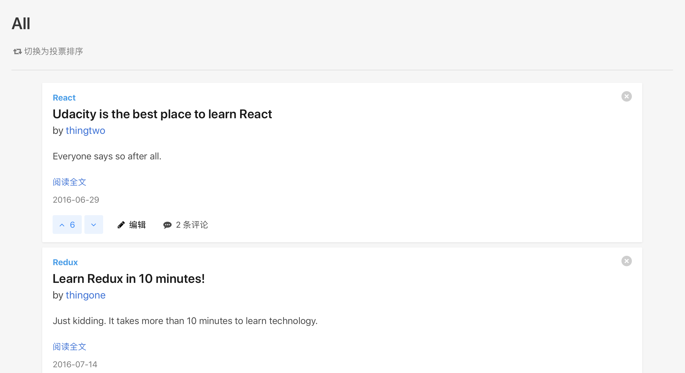
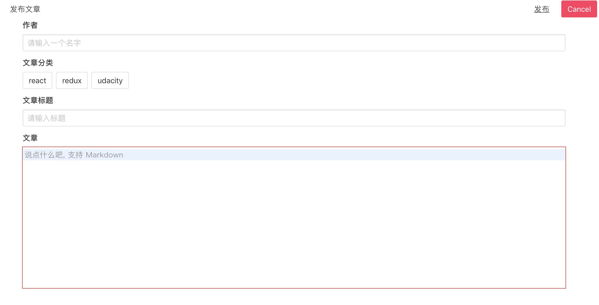

这个项目是 React 纳米学位的第二个项目

使用下面代码能就能运行了
```bash
yarn
cd api-server && yarn
cd ..
yarn start
```

因为需要代码中还包含了一个本地的后端代码，所以不能放在 GitHub Pages 下展示。

该项目主要用到了 [bulma](https://bulma.io/) 作为 css 库, Redux 的风格主要参考 redux 文档的内容。
其中用到了一些第三方库，
像 `Ramda，react-modal, codemirror, markdown-it`等以提升开发体验。

**PS: 虽然 dep 中，React 是 16.7，但是因为代码写得太早，不愿意也不容易重构成 hooks**

## 截图
### 导航栏:


### 主体


### 详情


### 新增

